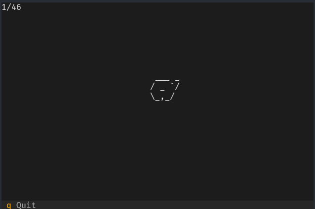

# KGana

Simple tool to test and train japanese writing.
There are many tools which test in the recognition direction (katakana/hiragana -> romaji) but not the more difficult romaji -> hiragana/katakana direction.

## Usage

It works by showing you the romaji as a query, and you have to produce either/both the corresponding hiragana and katakana characters on paper.
Pressing a key shows the solution, and pressing again goes on to the next kana.

You're supposed to track progress yourself.

## Demo

